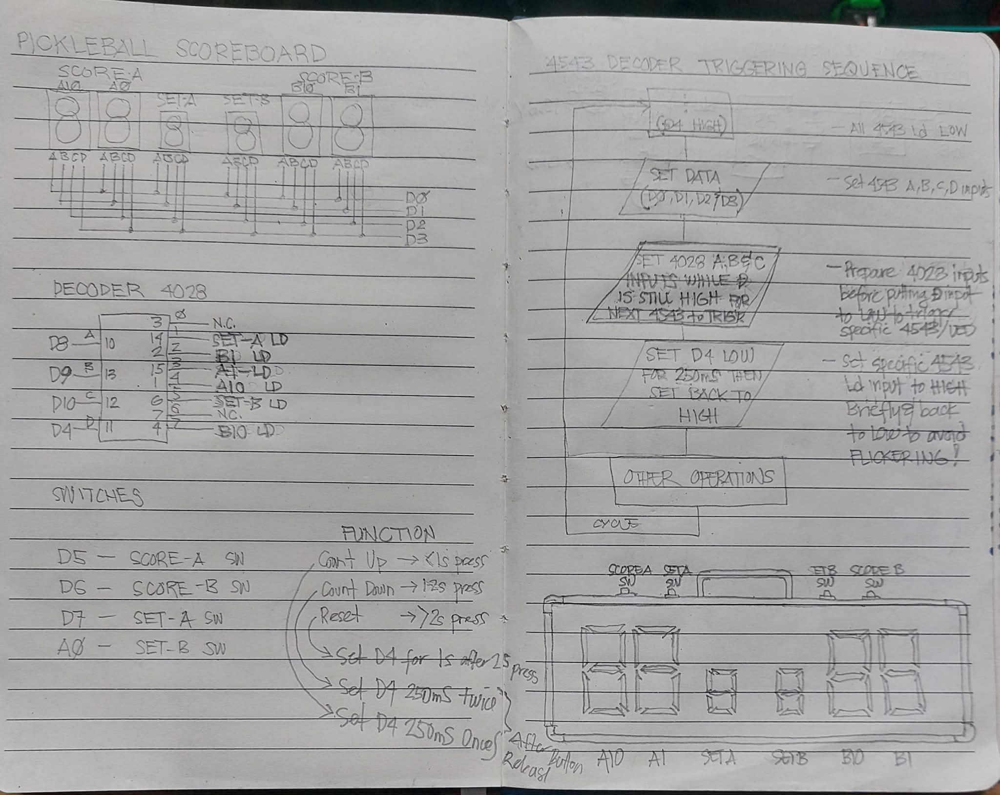

# Pickleball Scoreboard (NodeMCU V3)

Professional, modular Arduino firmware for a multiplexed 7-segment pickleball scoreboard.

## Wiring Diagram

Wiring image moved into docs assets for a cleaner root folder:

## Pin Map Used by Firmware

- Data bus: D0, D1, D2, D3
- 4028 decoder select bits: D8 (bit1/A), D9 (bit2/B), D10 (bit4/C)
- Latch or trigger pin: D4
- Switches: D5 score A, D6 score B, D7 set A, A0 set B

Note: A0 is handled as analog input in code. If your resistor network is different, tune ANALOG_BUTTON_PRESSED_THRESHOLD in src/Config.h.

## Project Architecture

- PickleballScoreboard.ino: Arduino entrypoint (setup, loop)
- src/Config.h: pin mapping, timing constants, decoder map, limits
- src/DisplayDriver.*: data bus and latch protocol implementation
- src/ButtonInput.*: debounced input with short or medium or long press classification
- src/ScoreModel.*: scoreboard state and bounded updates
- src/ScoreController.*: input-to-action orchestration
- src/ScoreboardApp.*: top-level singleton

## Functional Behavior

- Power-on defaults:
- score_A = 0
- score_B = 0
- set_score_A = OFF (data value >= 10)
- set_score_B = OFF (data value >= 10)
- Press behavior for each switch:
- Press under 1 second: increment
- Press over 1 second and under 2 seconds: decrement
- Press over 2 seconds: reset to 0
- Post-update D4 behavior:
- Short press: LOW 250 ms then HIGH
- Medium press: LOW 250 ms, HIGH 250 ms, LOW 250 ms, then HIGH
- Long press: LOW until release, then HIGH
- Value bounds:
- score_A and score_B: 0 to 99
- set_score_A and set_score_B: 0 to 10

## Display Protocol (Per Digit)

1. Keep D4 HIGH as idle.
2. Set data bus D0-D3 with desired BCD value.
3. Set decoder select bits on D8, D9, D10.
4. Pull D4 LOW for 1 ms.
5. Return D4 HIGH.

Decoder values:

- 001: set_score_A
- 010: score_B ones
- 011: score_A ones
- 100: score_A tens
- 101: set_score_B
- 111: score_B tens

OFF digit rule:

- Any value >= 10 on data bus blanks that digit.

## Very Detailed Flashing and Run Instructions

### 1. Hardware Checklist Before Connecting USB

1. Confirm board is NodeMCU V3 (ESP8266 based).
2. Confirm USB data cable is used (not charge-only cable).
3. Confirm shared ground between NodeMCU and display-driver hardware.
4. Confirm 4028 decoder and display power rails are correct for your hardware design.
5. Confirm the pin map above matches your physical wiring exactly.
6. Keep the board disconnected from high-current loads while first flashing.

### 2. Install USB Driver (Windows)

1. Plug NodeMCU into USB.
2. Open Device Manager.
3. Check Ports (COM and LPT).
4. If board is not recognized, install the matching USB-UART driver:
5. CH340 driver if your board uses CH340.
6. CP210x driver if your board uses Silicon Labs interface.
7. Reconnect board and note COM port number, for example COM5.

### 3. Install Arduino IDE and ESP8266 Board Package

1. Install Arduino IDE 2.x.
2. Open File > Preferences.
3. In Additional boards manager URLs add:
4. http://arduino.esp8266.com/stable/package_esp8266com_index.json
5. Open Tools > Board > Boards Manager.
6. Search for esp8266 by ESP8266 Community.
7. Install latest stable version.

### 4. Open the Project

1. Open Arduino IDE.
2. Open folder containing this project.
3. Open PickleballScoreboard.ino.
4. Verify tabs for src files are visible in IDE, or keep this structure intact on disk.

### 5. Select Correct Arduino IDE Settings

1. Tools > Board: NodeMCU 1.0 (ESP-12E Module).
2. Tools > Port: choose your COM port.
3. Tools > Upload Speed: 115200 (safe default).
4. Tools > CPU Frequency: 80 MHz.
5. Tools > Flash Size: 4MB (FS: disabled or default).
6. Tools > Debug Port: Disabled.
7. Tools > Debug Level: None.
8. Tools > Erase Flash: Only Sketch (or All Flash for clean first deployment).

### 6. Optional Configuration Before First Flash

1. Open src/Config.h.
2. If A0 button is too sensitive or not detected, adjust ANALOG_BUTTON_PRESSED_THRESHOLD.
3. If your board variant remaps D9 or D10, verify those definitions in your board package.

### 7. Build and Flash

1. Click Verify first.
2. Wait for compile success.
3. Click Upload.
4. If upload starts but fails to sync:
5. Hold FLASH button on board.
6. Tap RESET once while holding FLASH.
7. Release FLASH when upload begins.
8. Wait until Done uploading appears.

### 8. First Boot Validation (Functional Test)

1. Power cycle board once after flashing.
2. Confirm startup display:
3. score_A shows 00.
4. score_B shows 00.
5. set_score_A and set_score_B are blank/off.
6. Press score A briefly (<1 s): score A increments by 1.
7. Press score A for about 1.2 s then release: score A decrements by 1.
8. Press score A for over 2 s: score A resets to 00 and D4 hold behavior occurs.
9. Repeat same pattern for score B, set A, set B.
10. Confirm value clamping:
11. score fields do not exceed 99 and do not go below 0.
12. set fields do not exceed 10 and do not go below 0.

### 9. If Set-B (A0) Button Does Not Work Reliably

1. Measure A0 voltage at rest and when pressed.
2. Increase threshold if press value is above current threshold.
3. Decrease threshold if noise causes false triggers.
4. Reflash and retest.

### 10. Recommended Production Bring-Up Steps

1. Flash on bench power and USB only.
2. Validate all four button actions.
3. Validate each decoder channel by changing each displayed digit.
4. Run 20 to 30 random button interactions and verify no lockups.
5. After validation, close enclosure and re-run quick test.

## Troubleshooting

### Board not detected on COM port

1. Change USB cable.
2. Change USB port.
3. Install CH340 or CP210x driver.
4. Reboot Windows after driver install.

### Upload error: Failed to connect to ESP8266

1. Lower upload speed to 74880 or 57600.
2. Use FLASH plus RESET manual boot sequence.
3. Disconnect external circuitry from boot-sensitive pins temporarily if needed.

### Display flicker or wrong digit updates

1. Recheck D0-D3 order.
2. Recheck decoder bit wiring D8, D9, D10.
3. Recheck D4 latch line.
4. Verify ground reference is common.

### Unexpected button behavior

1. Confirm each switch pin wiring against Pin Map section.
2. Confirm INPUT_PULLUP style wiring for D5, D6, D7 switches.
3. Tune ANALOG_BUTTON_PRESSED_THRESHOLD for A0 switch.

## Quick Run Summary

1. Connect board.
2. Select NodeMCU 1.0 and COM port.
3. Verify.
4. Upload.
5. Power cycle.
6. Validate startup and button actions.
